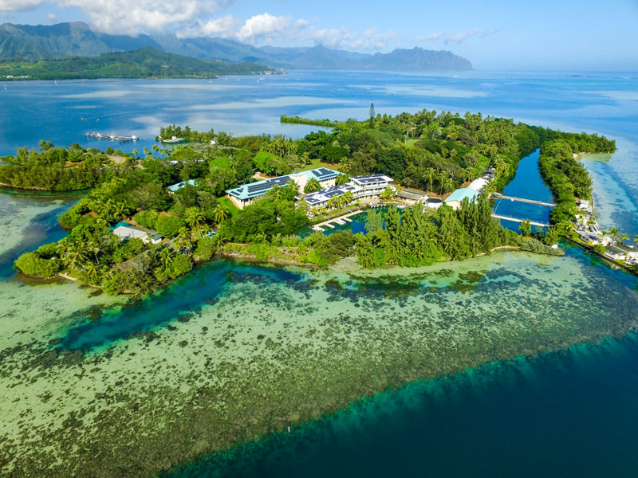

# Salome's Notebook
##Day 2 - Course
The summer course May-June 2019
In Hawaii at HIMB Summer Course to learn innovative tools and methods for marine research. 
Link: <http://www.himb.hawaii.edu/education/short-courses-workshops/>

$$ x^2 = \frac{y^2}{z^2} $$
Based on coconut island, see image below:

```{r, echo=FALSE, eval=FALSE} 
#echo=FALSE only displays the output
hist(rnorm(1000))
```


